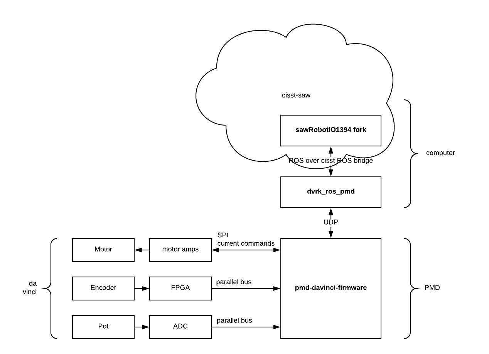
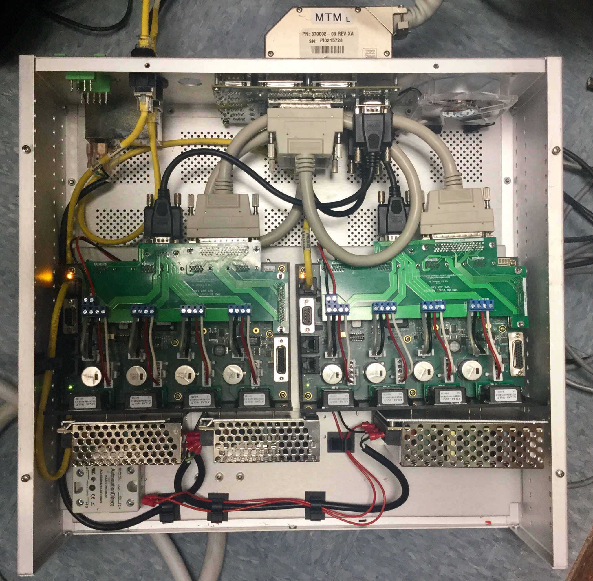

# PMD dVRK Project
**A dvrk-console-compatible motor driver based on PMD Prodigy/CME machine controller.** This repository only contains documentation and links to the components.

# Overview
The PMD machine controller is a complete motor control solution built with an ARM microcontroller to run user code, an FPGA to handle IO, and motor amplifiers (Atlas). The Atlas has a microcontroller for software current control and three half bridges. Because the current control runs in software (instead of hardware analog circuit with the low-pass filter in QLA), you get higher bandwidth and tuneable current control performance.

I wanted to make this PMD controller a drop-in replacement for the QLA+firewire controller. Unfortunately, [cisst-saw](https://github.com/jhu-cisst/cisst-saw) was not written with an alternative motor controller in mind. For now, part of this project exists as a fork of cisst-saw, which means the PMD-based controller cannot co-exist with the QLA+firewire-based controller. 

I made an adapter board that sits on top of the machine controller.



I removed the code in `sawRobotIO1394` that talks to the firewire, and **exposed the read/write of internal states (commanded motor current, encoder position/velocity, pot position, etc) to the ROS interface** by modifying the ROS bridge in `dvrk-ros`. 

I created a python script (can be found in `dvrk_ros_pmd`) to **serve as a bridge between the aforementioned states in `sawRobotIO1394` and the states on the PMD hardware**. It communicates with PMD hardware via UDP packets over ethernet. It communicates with `sawRobotIO1394` through ROS.

`pmd-davinci-firmware` runs on PMD. It parses the UDP packets from `dvrk_ros_pmd` and writes the desired motor output to the Atlas motor amplifiers. It reads encoder/pot/motor current and sends them as a broadcast packet over UDP to `dvrk_ros_pmd`.

`pypmd` talks to PMD via the Remote Access Protocol (based on TCP packets). It is a python re-implementation of the PMD host API because the API supplied by PMD heavily depends on windows socket, which does not work on gnu/linux. `pypmd` is good for sending few commands to PMD, but is too slow for real-time control.

# Repositories
* `cisst-saw` fork: modified `sawRobotIO1394` and other supporting components https://github.com/urill/cisst-saw
  * https://github.com/urill/sawRobotIO1394
  * https://github.com/urill/mechatronics-software
  * https://github.com/urill/cisst-ros
  * https://github.com/urill/sawIntuitiveResearchKit *temporary hack that should be reverted - see below*
* `dvrk-ros` fork: exposed some internal states to ROS https://github.com/urill/dvrk-ros
* `dvrk_ros_pmd`: python script that runs on your computer, talks to PMD over ethernet, and talks to `sawRobotIO1394` through ROS https://github.com/urill/dvrk_ros_pmd
* `pmd-davinci-firmware`: program that runs on the microcontroller on the PMD https://github.com/urill/pmd-davinci-firmware
* `pypmd`: native python api for PMD Remote Access Protocol https://github.com/urill/pypmd
* `pmd_davinci_adapter`: design files for the pmd -> dvrk interface adapter board https://github.com/urill/pmd_davinci_adapter
* `pmd-dvrk-docker`: *obsolete+broken*. dockerfile to create an environment for this project https://github.com/urill/pmd-dvrk-docker

# Hardware Setup


The controller box is pre-wired and ready to use as of Feb 2018.

**The box contains 120V circuit and you should handle it with respect. Unplug the power cable before you modify the circuit. Verify the wiring before you power it back on.**

The left PMD connects to 12V power and joints 5-7 (1-indexed). The right PMD connects to 24V power and joints 1-4.

Make sure the SCSI and DB9 cables are connected between the PMD and the interface board at the rear of the box. 

Each PMD connects to a port on the ethernet switch. They expect a gateway on `192.168.1.1` with the subnet mask of `24`. The static IP address for the left PMD is `192.168.1.42`, and `192.168.1.41` for the right one. If you don't have a router, set the IP address of your computer's ethernet interface to `192.168.1.1`. These TCP/IP parameters can be reconfigured in the Pro-Motion software.

# Software Setup

## cisst workspace
Because this project does not co-exist with the vanilla cisst-saw, you need a new ros workspace.

The steps are the same as acquiring the vanilla cisst-saw code, except you get the code from a different repository. https://github.com/jhu-cisst/cisst/wiki/Compiling-cisst-and-SAW-with-CMake

If you already have `catkin_ws`, use a different name for the new workspace.

```bash
mkdir -p ~/catkin_ws/src
cd ~/catkin_ws
catkin init

cd ~/catkin_ws/src
git clone https://github.com/urill/cisst-saw --recursive

# make sure we are in the right place
cd ~/catkin_ws
# make sure you have the proper ROS environment variables
source /opt/ros/kinetic/setup.bash
# create a profile named debug with _release extension
catkin config --profile release -x _release
# switch to newly created release profile
catkin profile set release
# set default CMake build type
catkin config --cmake-args -DCMAKE_BUILD_TYPE=Release
# build
catkin build
# set environment variables - MAKE SURE YOU SOURCE THE RIGHT FILE (debug vs. release)
source devel_release/setup.bash
```

Make sure this workspace does not extend your other workspaces that have `cisst-saw`.

```
catkin config
```

You should see

```
Profile:                     release
Extending:          [cached] /opt/ros/kinetic
...
```

If not, remove the other workspace from the config. http://catkin-tools.readthedocs.io/en/latest/verbs/catkin_config.html

## dvrk-ros

```bash
cd ~/catkin_ws/src
git clone https://github.com/urill/dvrk-ros
```

## dvrk_ros_pmd

Python version >= **3.6**

```bash
cd ~/catkin_ws/src
git clone https://github.com/urill/dvrk_ros_pmd
```

## don't forget to build
```
catkin build
source devel_release/setup.bash
```

# Run

## ros

Make sure your ROS environment variables are set. then

```
source /opt/ros/kinetic/setup.bash
source devel_release/setup.bash
```

## run the python script

change the value of `--arm` and `--pmd*` so they match your system.

`--pmd1` is the ip of the PMD that connects to joint 1, 2, 3, 4.

`--pmd5` is the ip of the PMD that connects to joint 5, 6, 7.

```
cd ~/catkin_ws/src/dvrk_ros_pmd/src
python3.6 io_pmd.py --arm=MTML --pmd1=192.168.1.42 --pmd5=192.168.1.41
```

## run the dvrk console like you used to

The json config for WPI dvrk MTML is provided [here](https://github.com/urill/dvrk_ros_pmd/tree/master/config).

```
roslaunch dvrk_robot dvrk_arm_rviz.launch arm:=MTML config:=/path/to/config/console-MTML.json 
```

Now use it like the regular old dvrk. You should see the rviz model moves with the real robot. You can try turning on the gravity compensation.


# Things that don't work
- E-stop not implemented
  - The solid state relay in the box is for DC only. Replace it with an AC relay.
- the foot pedal and gripper sensor inputs are not tested
- the communication between PMD ARM core and the motor amps seems to be very slow
  - I could only achieve 100+ Hz control cycle, which is way too slow for position PID
  - PMD is investigating this issue
- PMD stops listening to UDP randomly
  - PMD is investigating this issue
 
# Future work
- If the communication speed and reliability can be improved, `dvrk_ros_pmd` should be reimplemented in c++ and be part of `sawRobotIO1394` for simplicity. When you do that, **revert the `sawIntuitiveResearchKit` to the [jhu vanilla version](https://github.com/jhu-dvrk/sawIntuitiveResearchKit/).** The modification in my fork removed the homing sequence because the position PID does not work, causing the robot unable to home.
- If the communication issue cannot be resolved, you can try running to position and velocity loop on PMD. You will need to calculate the actuator position/velocity target because the loop in dvrk is joint-based instead of actuator-based.
